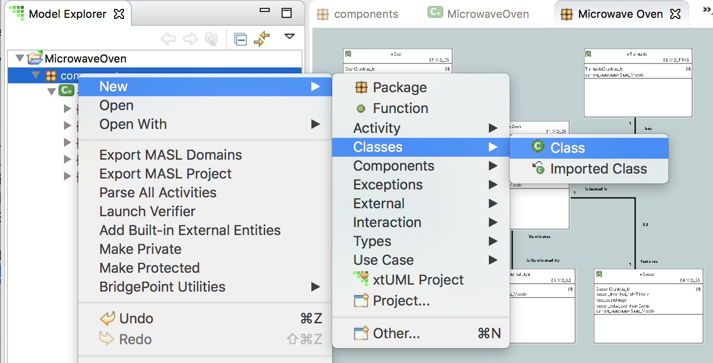
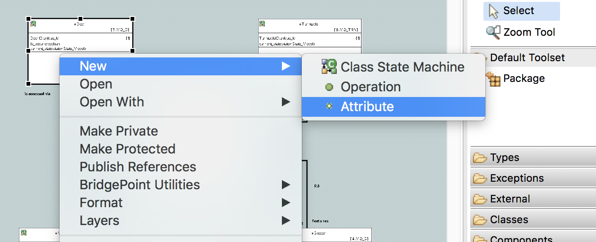
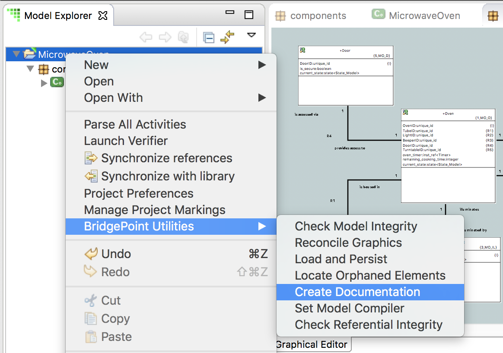

BridgePoint Context Menu Tools
===============================

BridgePoint allows the user to create model elements, run tools, and format canvases 
via context menu entries.  This document describes these tools.  Some of the tools have 
additional detailed help content in other sections of the Help system.    

The Model Explorer view context menu is shown in Figure 1.  This figure shows access 
into the submenus for creating a new model Class.    

   
__Figure 1__   

The diagram context menu is shown in Figure 2.  This figure shows access into the submenus 
for adding an attribute to the selected class.    

   
__Figure 2__   

## Shared Context Menu Entries

These menu entries appear on the context menu of Model Explorer and the canvas.  

| Tool                  | Description                          |
|-----------------------|--------------------------------------|
| Assign Component...   | Open dialog to select a component to assign the selected component reference to. |
| BridgePoint Utilities &#9658; ... | Described in detail in a stand-alone section below. |
| Cant Happen Event...  | Open dialog to specify an event to treat as can't happen in the selected state. |
| Disconnect            | Breaks the satisfaction of connected interfaces or interface references. |
| Ignore Event...       | Open dialog to specify an event to treat as ignored in the selected state. |
| Formalize... (Interface Reference) | Open dialog to formalize the selected interface reference to an interface definition. |
| Make Public           | Changes the visibility of the selection to public. |
| Make Private          | Changes the visibility of the selection to private. |
| Make Protected        | Changes the visibility of the selection to protected. |
| New &#9658; &lt;Element&gt; | Adds the selected model element as a child of the current selection. |
| Publish References    | Creates instance reference types for the selected class in the model called: `inst_ref<ClassName>` and `inst_ref_set<ClassName>`. |
| Put in Spotlight      | Adds the selection to the xtUML Debugging runtime spotlight for highlighting. |
| Remove from Spotlight | Removes the selection from the xtUML Debugging runtime spotlight. |
| Set Breakpoint        | Adds an OAL breakpoint on access of the selection. |
| Unassign              | Unassigns a component reference. |
| Unformalize           | Changes a formalized interface reference, association, etc... back to unformalized. |
__Table 1__   

## Model Explorer-specific Context Menu Entries

These menu entries appear on only the context menu of Model Explorer.   

| Tool                    | Description                          |
|-------------------------|--------------------------------------|
| Add Built-in External Entities | Adds the Logging, Time, and Architecture external entities to the selected package. |
| Add to Identifier...    | Opens dialog to add the selected attribute to a class identifier. |
| Cant Happen in State... | Opens dialog to specify a state the event should be treated as can't happen in. |
| Combine With...         | Opens dialog that allows the user to combine one referential attribute with another valid attribute. |
| Export MASL Domain(s)   | Create textual MASL Domains for the component(s) in the selection. |
| Export MASL Project     | Create a textual MASL Project for the component and component references in the selection. |
| Ignore in State...      | Opens dialog to specify a state the event should be ignored in. | 
| Launch Verifier         | Run the xtUML Model Debugging tool on the selection. |
| Manage Project Markings | Opens a dialog to manage markings stored in `features.mark` and `application.mark`. | 
| Move Down               | Move the selected attribute or parameter down in the parent's containment list. |
| Move Up                 | Move the selected attribute or parameter up in the parent's containment list. |
| Parse All Activities    | Parse the OAL action bodies in the selection and look for syntax issues. |
| Project Preferences     | Opens a dialog to manipulate project-specific BridgePoint settings. |
| Remove from Identifier... | Opens dialog to remove the selected attribute from being part of a class identifier. |
| Set as Base Attribute   | Change the attribute from a mathematically-derived attribute to a base attribute. | 
| Set as Derived Attribute| Change the attribute from a base attribute to a mathematically-derived attribute. | 
| Set From Provider       | Sets the direction of an interface message to "From Provider". |
| Set Return Type...      | Opens dialog to set the return data type of the selection. |
| Set To Provider         | Sets the direction of an interface message to "To Provider". |
| Set Type...             | Opens dialog to set the data type of the selection. |
| Split                   | Breaks a combined attribute back into the parts that where combined when it was created. |
| Synchronize references  | Update local interface references by pulling in changes to the referred-to interfaces. |
| Synchronize with library| Update remote interface references by pushing changes to local interfaces. |
__Table 2__   

## Canvas-specific Context Menu Entries

These menu entries appear on only the context menu of a diagram canvas.   

| Tool                    | Description                          |
|-------------------------|--------------------------------------|
| Assign Class...         | Open dialog to select a class to assign the selected imported class to. |
| Assign Event...         | Open dialog to select an event to assign the selected transition to. | 
| Assign Signal...        | Open dialog to select an interface signal to assign the selected transition to. | 
| Formalize... (Association) | Open dialog to formalize the selected association by copying referential attributes. |
| Format &#9658; ...      | Adjust the fill color and line color of the graphical element.  This is only for decoration and has no effect on model semantics. |
| Layers &#9658; ...      | Add the selected element to a layer. Hide all the elements on a layer.  Rename a layer.  Delete a layer (but not the contained model elements). |
| Mark Instance Destroyed | Add "X" to end of sequence communication line to mark point where the instance is destroyed. |
| Mark Instance Not Destroyed | Remove "X" from end of sequence communication line. |
| Remove Event            | Change the selected transition to have no event assigned. |
| Remove Signal           | Change the selected transition to have no signal assigned. | 
| Unformalize (Association) | Unformalize the selected association by removing referential attributes from participating classes. |
| Routing &#9658; ...     | Change the way connectors are drawn on the canvas: Oblique (angles allowed), Rectilinear (squared corners) |
| Toggle End Visibility   | Turn Communication Link end arrowhead on/off. |
| Toggle Start Visibility | Turn Communication Link start arrowhead on/off. |
__Table 3__  

## BridgePoint Utilities Menu
BridgePoint contains a number of tools that provide additional functionality outside 
of the core application modeling features.  These tools are accessed through the context 
menu in the Model Explorer view and on diagram canvases.  

The items inside this context menu are dependent upon the model element that is selected. Tools 
that are not pertinent or valid for the current selection are not displayed.  

### User Interface
To access the BridgePoint Utilities context-menu, right-click on an xtUML element in Model 
Explorer (Figure 3). 
   
   
__Figure 3__   
    
| Tool                  | Description                          |
|-----------------------|--------------------------------------|
| Check Model Integrity | Analyzes the in-memory model data to find problems. |
| Check Referential Integrity | Runs a command line tool that performs deep analysis of referential integrity. |
| Create Documentation  | Builds HTML documentation of the model using the model element descriptions and diagrams. |
| Generate Functions From List... | For model compiler developers.  Imports a specially-formatted file and creates xtUML functions in the selected package. |
| Load and Persist      | Traverses through all the underlying model data stored on disk, loads it, the writes it back out again. Validates cross-file references. |
| Locate Orphaned Elements | Another model analysis tool.  Opens a dialog that lists all "orphaned" model elements. |
| Reconcile Graphics    | Automatically creates graphical data for imported models that have none.   |
| Set Model Compiler    | Allows the user to change the model compiler associated with a xtUML project. |
__Table 4__   

  